# Part 1. Готовый докер

1) Взять официальный докер образ с nginx и выкачать его при помощи docker pull.

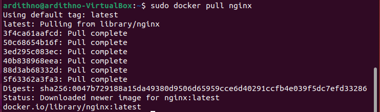
>Выкачиваем докер образ с nginx при помощи docker pull  

2) Проверить наличие докер образа через docker images.

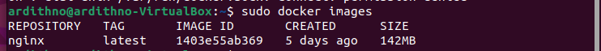
>Проверили наличие докер образа

3) Запустить докер образ через docker run -d [image_id|repository].

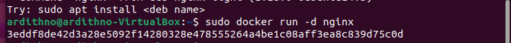
>Запустили докер образ nginx

4) Проверить, что образ запустился через docker ps.

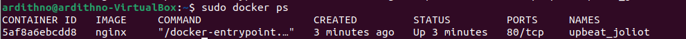
>Проверили запуск образа

5) Посмотреть информацию о контейнере через docker inspect [container_id|container_name].

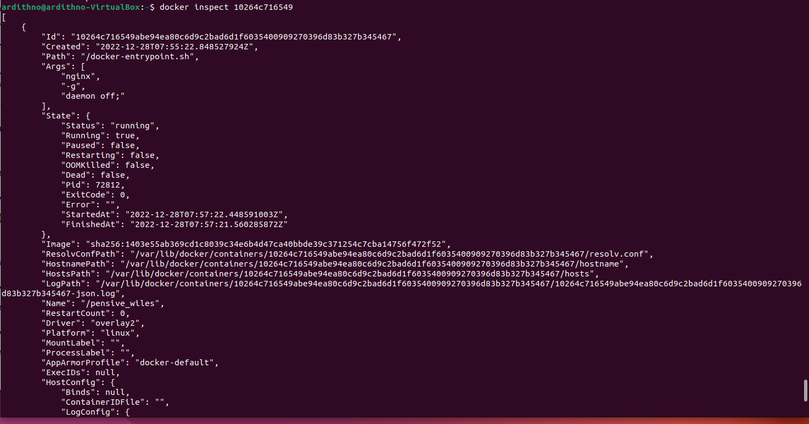
>Посмотрели информацию о контейнере

6) По выводу команды определить и поместить в отчёт размер контейнера, список замапленных портов и ip контейнера.

- размер контейнера: 67108864

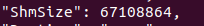

- список замапленных портов: null

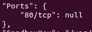

-  ip контейнера: 172.17.0.2

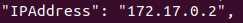

7) Остановить докер образ через docker stop [container_id|container_name].

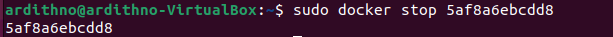
>Остановили докер образ

8) Проверить, что образ остановился через docker ps.

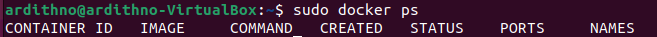
>Проверили остановку образа

9) Запустить докер с замапленными портами 80 и 443 на локальную машину через команду run.

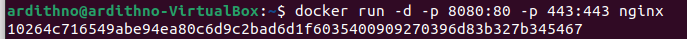
>Запустили докер с замапленными портами

10) Проверить, что в браузере по адресу localhost:80 доступна стартовая страница nginx.

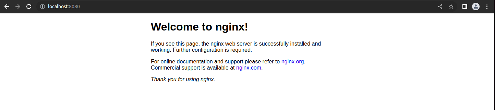
>Проверили, что стартовая страница доступна

11) Перезапустить докер контейнер через docker restart [container_id|container_name]. Проверить любым способом, что контейнер запустился.

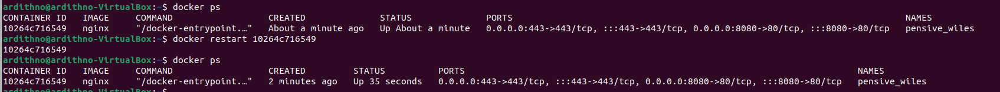
>Перезапустили докер контейнер и проверили, что контейнер запустился

# PART 2. Операции с контейнером

1) Прочитать конфигурационный файл nginx.conf внутри докер контейнера через команду exec.

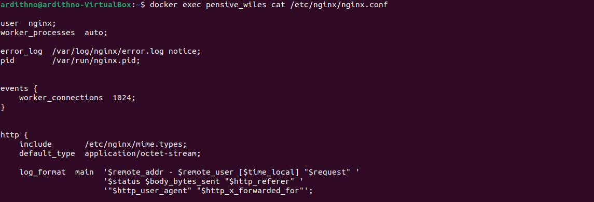
> Прочитали конфигурационный файл внутри контейнера

2) Создать на локальной машине файл nginx.conf.Настроить в нем по пути /status отдачу страницы статуса сервера nginx.

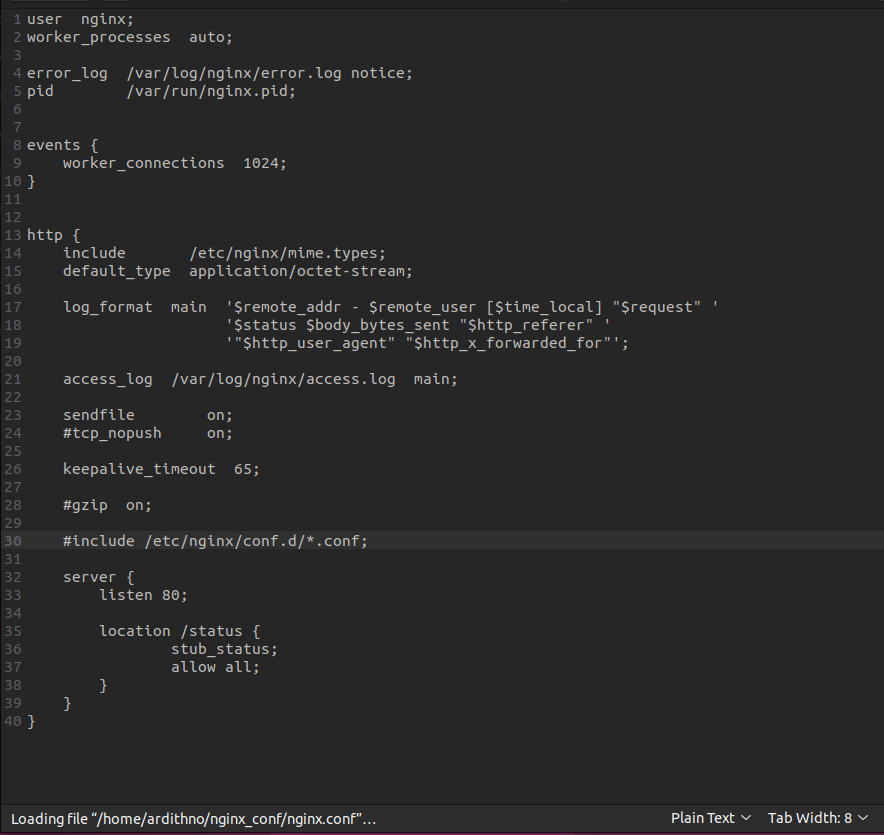
> Создали файл nginx.conf на локальной машине и настроили отдачу страницы

3) Скопировать созданный файл nginx.conf внутрь докер образа через команду docker cp.

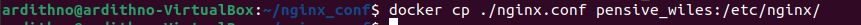
> Скопировали файл внутрь докер образа

4) Перезапустить nginx внутри докер образа через команду exec.

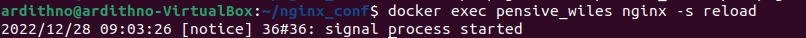
> Перезапустили nginx внутри докер образа

5) Проверить, что по адресу localhost:80/status отдается страничка со статусом сервера nginx.

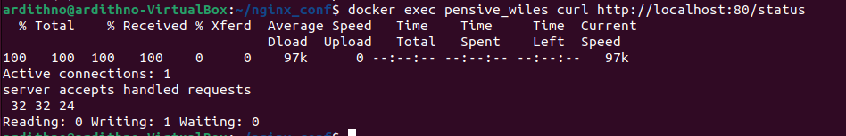
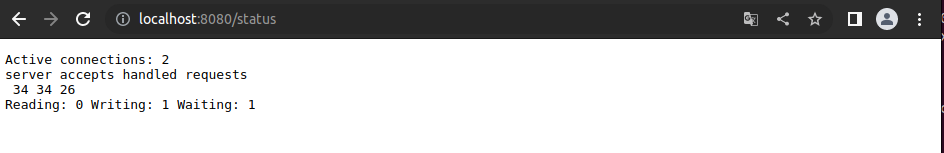
>Проверили, что страничка отдается

6) Экспортировать контейнер в файл container.tar через команду export.

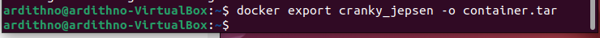
> Экспортировать контейнер в файл

7) Остановить контейнер.

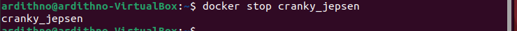
>Остановили контейнер

8) Удалить образ через docker rmi [image_id | repository], не удаляя перед этим контейнеры.

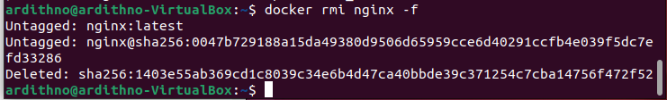
>Удалили образ

9) Удалить остановленный контейнер.

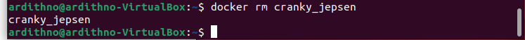
 >Удалили контейнер

10) Импортировать контейнер обратно через команду import.

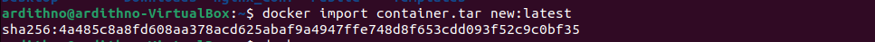
>Импортировали контейнер обратно

11) Запустить импортированный контейнер.

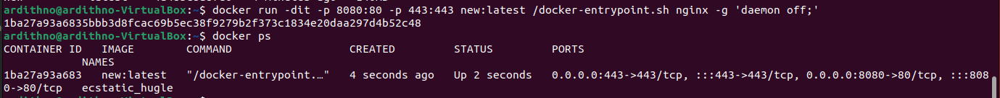
>Запустили контейнер

12) Проверить, что по адресу localhost:80/status отдается страничка со статусом сервера nginx.

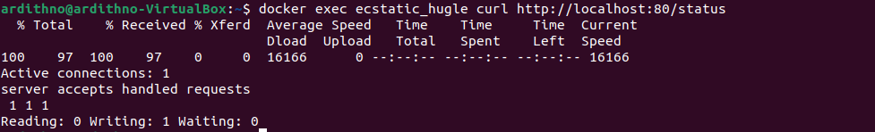
>Проверили, что по адреся отдается страничка.

# Part 3. Мини веб-сервер

1) Загрузим нужные пакеты

- sudo apt-get install libfcgi-dev
- sudo apt-get install spawn-fcgi
- sudo apt-get install nginx

2) Напишем мини-сервер на C

3) Настроим nginx

Далее мы настроим nginx для прослушивания HTTP-запросов на порту 81 и переадресации их по процессу fcgi, который будет прослушивать порт 8080.

Ключевая директива fastcgi_pass 127.0.0.1:8080 указывает, что nginx должен перенаправить запрос fcgi на порт 8080 на локальном хосте. Остальные fastcgi_param директивы являются необязательными и просто устанавливают соответствующие переменные среды, которые перенаправляются в приложение fcgi.

3) Запустим код

-  запустим nginx, используя предоставленную конфигурацию

> sudo nginx -c <путь до nginx.conf>

- скомпилируем программу

> gcc hello.c -o hello.fcgi -lfcgi

- создать приложение fcgi на порту 8080 

> spawn-fcgi -p 8080 -f ./hello.fcgi

- посмотреть процессы на порте:

> sudo lsof -i:<порт>

# Part 4. Готовый докер
1) Сбилдим образ

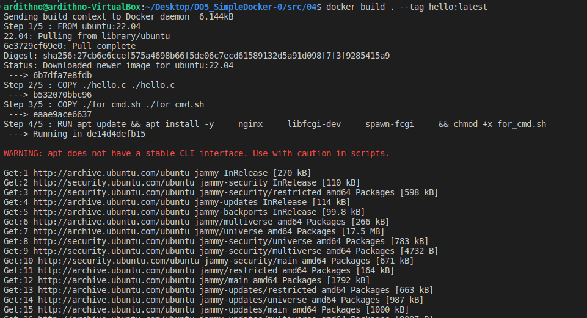

2) Проверим, что образ сбилдился

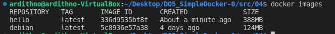

3) Запустить контейнер

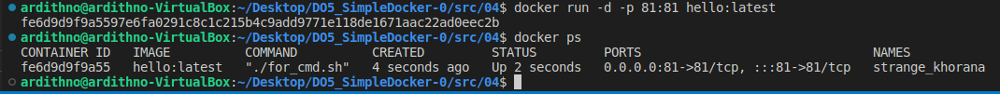

4) Проверяем доступ странички

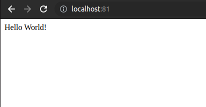

5) Допишем проксирование странички /status

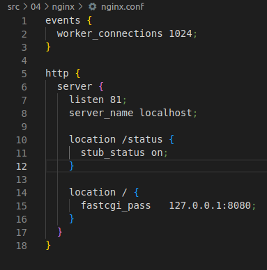

6)  Проверим доступ странички статуса

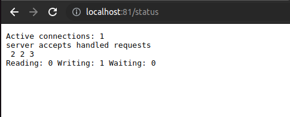

# Part 5. Dockle

1) Сканируем образ с помощью Dockle

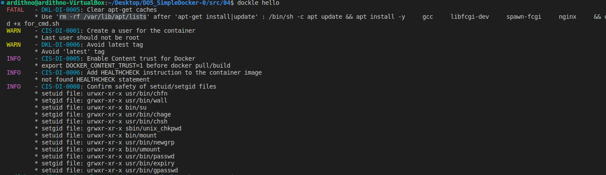

2) Исправляем все ошибки и сканируем повторно

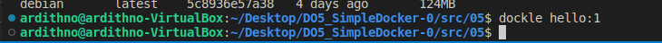

# Part 6. Базовый Docker Compose

1) Создаем сеть

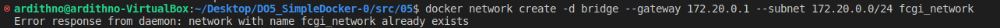

2) Билдим образ

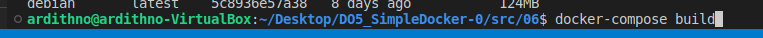

3) Запускаем контейнеры

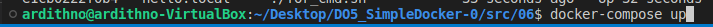